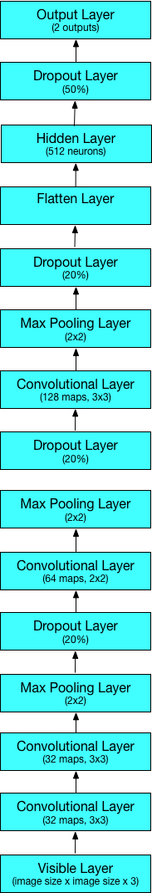
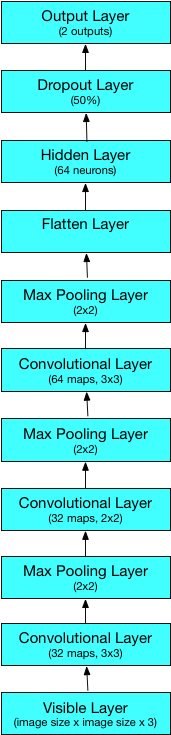

# Instructions.

## 1 - EDA.
Notebook `01-tasty-images-EDA.ipynb` is intended to explore data and perform some initial analysis to gain insights as well as present some visualizations.

## 2 - Getting the data.
After EDA, it was decided that the best images are from `epicurious.com` as they have high social media scores and they are taken by professionals, so the good images will be curated from that site. Also, the worse images are coming from `food.com` as they have low social scores and they are taken by amateurs by their smartphones. Even though a given food recipe may high reviews, the associated photos can be of really bad quality, not appealing at all.

Also, most of the food recipes acquired by Wellio are sourced from `food.com` and `epicurious.com`.

We will get 10,000 images from each site, totaling a balanced data set of 20,000 images.

Images will be copied over a bucket in Google Cloud Storage as the storage in Datalab is ephemeral.

This can be found in notebook `02-tasty-images-download-images.ipynb`.

## 3 - Splitting images into a training and testing data sets.
This functionality has not been used for the project, but it can be useful and handy if required.

This can be found in the notebook `03-tasty-images-create-train-test-split-images.ipynb`.

## 4 - Images pre-processing.
Images come on different sizes, mostly 640 pixels wide and 480 pixels tall. We resize them to a desired size and use `keras.preprocessing.image` to convert them into tensors using a custom function dl_functions.`normalize_images_array`
found in the script `dl_functions.py` in the `scripts` folder.

The sizes used are 25, 50 and 100. The created data sets, ready to train a model, will be saved as pickle files and then stored into Google Cloud Storage as well.

Note that due to lack of enough computing resources, I was not able to pre-process the images to a bigger size (i.e 150 and bigger).

This can be found in the notebook `4-tasty-images-pre-processing-images.ipynb`.

## 5 - Training convolutional neural network models.

Google Datalab does not support GPUs. For data augmentation only 10 epochs were performed as it can take more than a day to train a model, and even 5 epochs for images of bigger size.

The architectures used can be found on `dl_functions.py` file under the `scripts` folder.

Here are the diagrams of the architectures:

### First architecture.



### Second architecture.



The following two notebooks were intended to train some convolutional neural network architectures with few images to check their performance.

`05-tasty-images-CNN-model-initial-1.ipynb`

`06-tasty-images-CNN-model-initial-2.ipynb`

The following notebook train models with images resized to 25.

`07-tasty-images-CNN-model-image-size-25.ipynb`

The following two notebooks train models with images resized to 50.

`08-tasty-images-CNN-model-image-size-50-1.ipynb`

`09-tasty-images-CNN-model-image-size-50-2.ipynb`

The following notebook train models with images resized to 100.

`10-tasty-images-CNN-model-image-size-100.ipynb`

The following notebook train models with images resized to 25 using data augmentation.

`11-tasty-images-CNN-data-augmentation-model-image-size-25.ipynb`

Similar to above, but using GPUs in a Jupyter notebook in a docker container.

The following notebook train models with images resized to 25 using data augmentation with a CNN with 10 layers.

`12-tasty-images-CNN-data-augmentation-model-image-size-25-cnn-10-layers-GPUs.ipynb`

The following notebook train models with images resized to 50 using data augmentation.

`13-tasty-images-CNN-data-augmentation-model-image-size-50.ipynb`

The following notebook train models with images resized to 50 using data augmentation with a CNN with 10 layers.

`14-tasty-images-CNN-data-augmentation-model-image-size-50-cnn-10-layers-GPUs.ipynb`

The following notebook train models with images resized to 100 using data augmentation.

`15-tasty-images-CNN-data-augmentation-model-image-100-1.ipynb`

Experiment was repeated again (I forgot to save the model in the previous notebook):

`16-tasty-images-CNN-data-augmentation-model-image-100-2.ipynb`

## 6 - Transfer learning.

The following two notebooks were run locally instead of Google Datalab due to issues installing `h5py`. The library is required to load the weights from any architecture.

In this case, we use `InceptionV3` and extract the features from the last layer. First, we pre-process the images (they were downloaded locally from the cloud), and then we fit some machine learning models, like logistic regression.

`17-transfer-learning-InceptionV3-data-prep-1.ipynb`

`18-transfer-learning-InceptionV3-models-2.ipynb`

A full example of transfer learning in the cloud using `Tensorflow` and `InceptionV3` can be found in the [`transfer_learning`](transfer_learning) folder.

## 7 - Google Storage API documentation.

https://pypi.python.org/pypi/google-cloud-storage

https://cloud.google.com/storage/docs/xml-api/gspythonlibrary

https://cloud.google.com/appengine/docs/standard/python/googlecloudstorageclient/read-write-to-cloud-storage

https://googlecloudplatform.github.io/google-cloud-python/stable/storage-client.html

http://stackoverflow.com/questions/36314797/write-a-pandas-dataframe-to-google-cloud-storage-or-bigquery

http://stackoverflow.com/questions/36837909/access-google-cloud-storage-bucket-from-other-project-using-python

https://gorka.eguileor.com/python_gcs_client/

## 8 - Example Create CPU Instance.

Only if a instance is created via command line, it will accessible using Google Datalab:

```
datalab create --machine-type n1-standard-4 name_of_your_instance
```

where `name_of_your_instance` is the name you want to give to it.

A list of available instances can be found using the following command:

```
gcloud compute machine-types list
```
