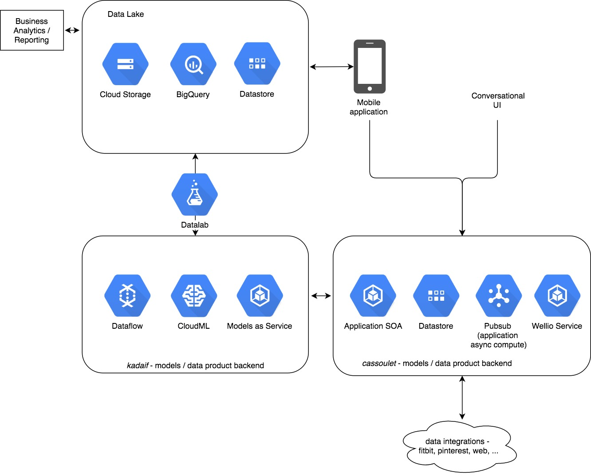

# DSCI6051-student
GalvanizeU-University of New Haven Master of Science in Data Science - DSCI6051: Data Science Capstone Project.

This project consists in building an image classifier for food images for [wellio](http://www/getwellio.com) using convolutional neural networks (with `Keras` API using `Tensorflow` as backend).

Transfer learning using the `InceptionV3` architecture has been implemented and can be found on the [`transfer_learning`](transfer_learning) folder.

Wellio’s recommendation system allows a user to ask for recipe through a conversational interface. When retrieving the search results, Wellio ranks them using various criteria. Wellio has noticed that their customers tend to choose recipes that are more visually appealing when the results are displayed. Hence, Wellio need to enable the search to also rank on appearance of the recipe.

Product Use Case.
-----------------
As a user I can search for recipes and get back recipes that have appealing images.

Tech Use Case.
--------------
Design an algorithm that classifies images of recipes to appealing/not appealing.


Wellio's Architecture.
----------------------



Environment set up.
-------------------
An anaconda environment with python 2.7 needs to be set up in order to connect to Google's Cloud.

[Here are instructions on how create an  environment](https://uoa-eresearch.github.io/eresearch-cookbook/recipe/2014/11/20/conda/).

After that, we need to:

1. Setup Google Cloud Platform SDK.

Install Google Cloud Platform SDK https://cloud.google.com/sdk/downloads and follow the instructions for `interactive installer`.

2. Setup Datalab.

Install Datalab https://cloud.google.com/datalab/docs/quickstarts and use zone=us-west1-a and project-id `wellio-kadaif` options.

Here is a summary of all installed libraries in the anaconda environment:

```
ansicolors==1.0.2
apache-beam==0.6.0
appdirs==1.4.3
appnope==0.1.0
avro==1.8.1
backports-abc==0.5
backports.shutil-get-terminal-size==1.0.0
backports.ssl-match-hostname==3.4.0.2
bleach==1.5.0
chainmap==1.0.2
click==6.7
combomethod==1.0.9
configparser==3.5.0
crcmod==1.7
cycler==0.10.0
decorator==4.0.11
dill==0.2.6
entrypoints==0.2.2
enum34==1.1.6
Flask==0.12.1
funcsigs==1.0.2
functools32==3.2.3.post2
google-api-python-client==1.6.2
google-apitools==0.5.8
google-auth==0.9.0
google-auth-httplib2==0.0.2
google-cloud-bigquery==0.22.1
google-cloud-core==0.24.0
google-cloud-dataflow==0.6.0
google-cloud-storage==1.0.0
googleapis-common-protos==1.5.2
GoogleAppEngineCloudStorageClient==1.9.22.1
googledatastore==7.0.0
h5py==2.7.0
html5lib==0.999
httplib2==0.9.2
ipykernel==4.5.2
ipython==5.3.0
ipython-genutils==0.1.0
ipywidgets==6.0.0
itsdangerous==0.24
Jinja2==2.9.5
jsonschema==2.5.1
jupyter==1.0.0
jupyter-client==5.0.0
jupyter-console==5.1.0
jupyter-core==4.3.0
Keras==2.0.3
MarkupSafe==0.23
matplotlib==2.0.0
mementos==1.2.6
mistune==0.7.4
mock==2.0.0
nbconvert==5.1.1
nbformat==4.3.0
networkx==1.11
notebook==4.4.1
nulltype==2.2.9
numpy==1.12.1
oauth2client==3.0.0
olefile==0.44
options==1.4.5
packaging==16.8
pandas==0.19.2
pandocfilters==1.4.1
pathlib2==2.2.0
pbr==2.0.0
pexpect==4.2.1
pickleshare==0.7.4
Pillow==4.1.0
prompt-toolkit==1.0.13
proto-google-cloud-datastore-v1==0.90.0
protobuf==3.2.0
ptyprocess==0.5.1
pyasn1==0.2.3
pyasn1-modules==0.0.8
Pygments==2.2.0
pyparsing==2.2.0
python-dateutil==2.6.0
pytz==2016.10
PyWavelets==0.5.2
PyYAML==3.12
pyzmq==16.0.2
qtconsole==4.2.1
readline==6.2.4.1
rsa==3.4.2
say==1.4.5
scandir==1.5
scikit-image==0.13.0
scikit-learn==0.18.1
scipy==0.19.0
seaborn==0.7.1
show==1.4.8
simplegeneric==0.8.1
simplere==1.2.11
singledispatch==3.4.0.3
six==1.10.0
subprocess32==3.2.7
tensorflow==1.0.1
terminado==0.6
testpath==0.3
textdata==1.7.1
Theano==0.9.0
tornado==4.4.2
traitlets==4.3.2
uritemplate==3.0.0
wcwidth==0.1.7
Werkzeug==0.12.1
widgetsnbextension==2.0.0
```

All notebooks have been developed and run in Google's Cloud Datalab.

Here is a [detailed description of each one](Instructions.md).

A tutorial has been create to [use GPUs with Jupyter notebooks by creating a virtual instance in Google Cloud](install_cuda_google_cloud).
