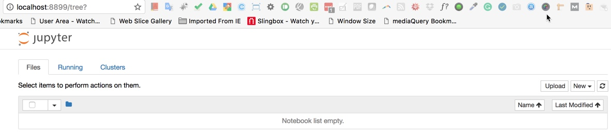
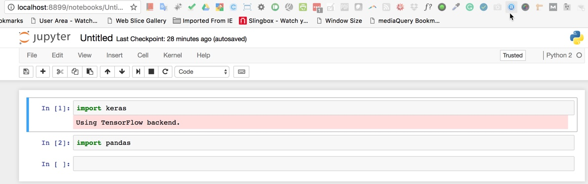

# SETTING UP CUDA IN GOOGLE CLOUD INSTANCE TO WORK WITH TENSORFLOW AND KERAS.

Google Datalab does not allow to work with CUDA and GPUs.

Here is a short tutorial on how to make it possible. I have used the following sources to come up with a solution:

https://medium.com/google-cloud/running-jupyter-notebooks-on-gpu-on-google-cloud-d44f57d22dbd

https://www.digitalocean.com/community/tutorials/how-to-set-up-a-jupyter-notebook-to-run-ipython-on-ubuntu-16-04

## 1 - ACTIVATE ENVIROMENT USED IN THIS PROJECT:

```
Admins-MBP:~ carles$ source activate wellio
(wellio) Admins-MBP:~ carles$
```

## 2 - CREATE VIRTUAL INSTANCE  ON GOOGLE CLOUD ON COMMAND LINE ON LOCAL MAC:

```
$gcloud beta compute instances create gpu-images --machine-type n1-highmem-8 --zone us-east1-d --accelerator type=nvidia-tesla-k80,count=4 --image-family ubuntu-1604-lts --image-project ubuntu-os-cloud --boot-disk-size 200GB --maintenance-policy TERMINATE --restart-on-failure
```

NOTE THAT WE CREATE AN INSTANCE WITH 4 GPUs IN THIS EXAMPLE (`count=4`) WITH AN UBUNTU IMAGE ON A MACHINE TYPE `--machine-type n1-highmem-8`. AS OF NOW, GPUs IN THE U.S. ONLY AVAILABLE IN `--zone us-east1-d`. THE NAME OF THE INSTANCE WE GIVE IS `gpu-images`.

THIS IS THE OUTPUT:

```
NAME        ZONE        MACHINE_TYPE  PREEMPTIBLE  INTERNAL_IP  EXTERNAL_IP     STATUS
gpu-images  us-east1-d  n1-highmem-8               10.142.0.2   35.185.122.94
```

## 3 - CONNECT TO THE INSTANCE FROM THE COMMAND LINE:

```
$gcloud compute ssh gpu-images --zone us-east1-d
```

## 4 - ONCE LOGGED ON INSTANCE, RUN THE FOLLOWING COMMANDS ONE BY ONE:

```
$curl -O http://developer.download.nvidia.com/compute/cuda/repos/ubuntu1604/x86_64/cuda-repo-ubuntu1604_8.0.61-1_amd64.deb

$sudo dpkg -i cuda-repo-ubuntu1604_8.0.61-1_amd64.deb

$sudo apt-get update

$sudo apt-get install cuda -y

$rm cuda-repo-ubuntu1604_8.0.61-1_amd64.deb

$nvidia-smi
```

FROM THE LAST COMMAND, YOU SHOULD SEE AN OUTPUT SIMILAR TO THIS ONE:

```
+-----------------------------------------------------------------------------+
| NVIDIA-SMI 375.51                 Driver Version: 375.51                    |
|-------------------------------+----------------------+----------------------+
| GPU  Name        Persistence-M| Bus-Id        Disp.A | Volatile Uncorr. ECC |
| Fan  Temp  Perf  Pwr:Usage/Cap|         Memory-Usage | GPU-Util  Compute M. |
|===============================+======================+======================|
|   0  Tesla K80           On   | 0000:00:04.0     Off |                    0 |
| N/A   55C    P0    69W / 149W |      0MiB / 11439MiB |      0%      Default |
+-------------------------------+----------------------+----------------------+
|   1  Tesla K80           On   | 0000:00:05.0     Off |                    0 |
| N/A   54C    P0    70W / 149W |      0MiB / 11439MiB |      0%      Default |
+-------------------------------+----------------------+----------------------+
|   2  Tesla K80           On   | 0000:00:06.0     Off |                    0 |
| N/A   38C    P0    60W / 149W |      0MiB / 11439MiB |      0%      Default |
+-------------------------------+----------------------+----------------------+
|   3  Tesla K80           On   | 0000:00:07.0     Off |                    0 |
| N/A   57C    P0    72W / 149W |      0MiB / 11439MiB |     70%      Default |
+-------------------------------+----------------------+----------------------+

+-----------------------------------------------------------------------------+
| Processes:                                                       GPU Memory |
|  GPU       PID  Type  Process name                               Usage      |
|=============================================================================|
|  No running processes found                                                 |
+-----------------------------------------------------------------------------+
```

## 5 - RUN THE FOLLOWING COMMAND ON THE CLOUD INSTANCE, ONE BY ONE:

```
echo 'export CUDA_HOME=/usr/local/cuda' >> ~/.bashrc

echo 'export PATH=$PATH:$CUDA_HOME/bin' >> ~/.bashrc

echo 'export LD_LIBRARY_PATH=$LD_LIBRARY_PATH:$CUDA_HOME/lib64' >> ~/.bashrc

source ~/.bashrc
```

## 6- REGISTER AT https://developer.nvidia.com/cudnn AND DOWNLOAD cuDNN IN YOUR LOCAL MAC. THEN scp TO THE CLOUD INSTANCE:

IN THIS CASE, I HAVE DOWNLOADED IN THE DOWNLOADS FOLDER. ALSO, THE IP ADDRESS OF THE INSTANCE WILL BE DIFFERENT (EXTERNAL IP ADDRESS).

```
$scp -i .ssh/google_compute_engine ~/Downloads/cudnn-8.0-linux-x64-v5.1.tgz 35.185.122.94:
```

## 7 - BACK TO THE COMMAND LINE AT THE CLOUD INSTANCE, RUN THE FOLLOWING COMMANDS ONE BY ONE:

```
$tar xzvf cudnn-8.0-linux-x64-v5.1.tgz

$sudo cp cuda/lib64/* /usr/local/cuda/lib64/

$sudo cp cuda/include/cudnn.h /usr/local/cuda/include/
```

## 8 - ALSO IN THE COMMAND LINE OF THE CLOUD INSTANCE, RUN ONE BY ONE:

```
$sudo apt-get update

$sudo apt-get -y install python2.7 python-pip python-dev

$python --version
```

YOU SHOULD SEE SOMETHING LIKE:

`Python 2.7.11+`

```
$pip --version
```

YOU SHOULD SEE SOMETHING LIKE:

`pip 8.1.1 from /usr/lib/python2.7/dist-packages (python 2.7)`

THEN INSTALL, ONE BY ONE:

```
$sudo apt-get -y install ipython ipython-notebook

$sudo -H pip install jupyter
```

IF YOU GET AN ERROR, AND/OR SOME OUTPUT LIKE:

```
You are using pip version 8.1.1, however version 8.1.2 is available.
You should consider upgrading via the 'pip install --upgrade pip' command.
```

THEN RUN THE FOLLOWING COMMANDS ONE BY ONE:

```
$sudo -H pip install --upgrade pip

$sudo -H pip install jupyter
```

## 9 - INSTALL TENSORFLOW FROM BINARIES TO COMPILE WITH CUDA. AT THE CLOUD INSTANCE, RUN THE FOLLOWING COMMANDS ONE BY ONE:

```
export TF_BINARY_URL=https://storage.googleapis.com/tensorflow/linux/gpu/tensorflow-0.11.0-cp27-none-linux_x86_64.whl

sudo pip install --upgrade $TF_BINARY_URL

sudo pip install keras
```

**NOTE: THE TENSORFLOW BINARIES ARE NOT THE LATEST TENSORFLOW RELEASE.**

**AFTER SOME EXPERIMENTATION, IT'S ADVISABLE NOT TO INSTALL TENSORFLOW THAT WAY**

**SOME PYTHON LIBRARIES LIKE PICKLE WON'T WORK PROPERLY.**

**UNTIL NEW BINARIES ARE AVAILABLE, USE INSTEAD:**

```
sudo pip install tensorflow-gpu
sudo pip install keras
```

**AS A RESULT, THE NEXT SECTION WON'T WORK (TENSORFLOW/KERASCOMPILING WITH CUDA).**

## 10 - TEST IF TENSORFLOW/KERAS IS WORKING WITH CUDA. FROM THE CLOUD INSTANCE, RUN THE FOLLOWING:

```
carles@gpu-images:~$ python
Python 2.7.12 (default, Nov 19 2016, 06:48:10)
[GCC 5.4.0 20160609] on linux2
Type "help", "copyright", "credits" or "license" for more information.
>>> import tensorflow
I tensorflow/stream_executor/dso_loader.cc:111] successfully opened CUDA library libcublas.so locally
I tensorflow/stream_executor/dso_loader.cc:111] successfully opened CUDA library libcudnn.so locally
I tensorflow/stream_executor/dso_loader.cc:111] successfully opened CUDA library libcufft.so locally
I tensorflow/stream_executor/dso_loader.cc:111] successfully opened CUDA library libcuda.so.1 locally
I tensorflow/stream_executor/dso_loader.cc:111] successfully opened CUDA library libcurand.so locally
>>> quit()
```
```
carles@gpu-images:~$ python
Python 2.7.12 (default, Nov 19 2016, 06:48:10)
[GCC 5.4.0 20160609] on linux2
Type "help", "copyright", "credits" or "license" for more information.
>>>
>>> import keras
Using TensorFlow backend.
I tensorflow/stream_executor/dso_loader.cc:111] successfully opened CUDA library libcublas.so locally
I tensorflow/stream_executor/dso_loader.cc:111] successfully opened CUDA library libcudnn.so locally
I tensorflow/stream_executor/dso_loader.cc:111] successfully opened CUDA library libcufft.so locally
I tensorflow/stream_executor/dso_loader.cc:111] successfully opened CUDA library libcuda.so.1 locally
I tensorflow/stream_executor/dso_loader.cc:111] successfully opened CUDA library libcurand.so locally
>>> quit()
```

YOU SHOULD BE THE ABOVE MESSAGES IF TENSORFLOW IS WORKING WITH CUDA.

## 11 - FROM THE COMMAND LINE OF THE CLOUD INSTANCE RUN THE FOLLOWING COMMANDS ONE BY ONE:

```
$sudo pip install pandas h5py sklearn

$sudo apt-get install python-matplotlib
```

## 12 - FROM THE COMMAND LINE OF THE CLOUD INSTANCE RUN THE FOLLOWING COMMAND:

`$jupyter notebook --generate-config`

YOU SHOULD GET AN OUTPUT LIKE:

```
Writing default config to: /home/carles/.jupyter/jupyter_notebook_config.py
```

## 13 - FROM THE COMMAND LINE OF THE CLOUD INSTANCE RUN THE FOLLOWING COMMAND:

`$nano /home/carles/.jupyter/jupyter_notebook_config.py`

THEN ADD THE FOLLOWING LINES:
```
c = get_config()  # get the config object
c.IPKernelApp.pylab = 'inline'  # in-line figure when using Matplotlib
c.NotebookApp.open_browser = False  # do not open a browser window by default when using notebooks
c.NotebookApp.token = '' # No token. But, please, please always use jupyter over ssh tunnel
```

THIS IS HOW THE CONFIGURATION FILE SHOULD LOOK LIKE:

```
# Configuration file for jupyter-notebook.
c = get_config()
c.IPKernelApp.pylab = 'inline'
c.NotebookApp.open_browser = False
c.NotebookApp.token = ''
```

## 14 - CREATE A SSH TUNNEL TO LAUNCH JUPYTER. RUN THIS FROM YOUR LOCAL MAC.

NOTE THAT WE WILL USE PORT 8899, AND THAT WE SPECIFY THE EXTERNAL IP ADDRESS OF THE CLOUD INSTANCE WITH OUR USER NAME: carles@35.185.122.94

```
$ssh -i .ssh/google_compute_engine -L 8899:localhost:8888 carles@35.185.122.94
```

## 15 - FROM THE COMMAND LINE OF THE CLOUD INSTANCE RUN THE FOLLOWING COMMAND:

`$pwd`

YOU SHOULD BE AT `/home/carles`

THEN, ISSUE THE FOLLOWING COMMANDS ONE BY ONE:

```
mkdir notebooks
cd notebooks
jupyter notebook
```

## 16 - IN YOUR LOCAL MAC, GO TO CHROME AND RUN `localhost:8899`

CREATE A NOTEBOOK AND ENTER:

`import keras`

RUN THE CELL. YOU SHOULD SEE:

`Using TensorFlow backend.`





YOU SHOULD ALSO SEE FROM THE COMMAND LINE OF THE CLOUD INSTANCE:

```
[I 02:53:37.182 NotebookApp] Kernel started: 96f94316-b551-495b-b771-24107ae10379
I tensorflow/stream_executor/dso_loader.cc:111] successfully opened CUDA library libcublas.so locally
I tensorflow/stream_executor/dso_loader.cc:111] successfully opened CUDA library libcudnn.so locally
I tensorflow/stream_executor/dso_loader.cc:111] successfully opened CUDA library libcufft.so locally
I tensorflow/stream_executor/dso_loader.cc:111] successfully opened CUDA library libcuda.so.1 locally
I tensorflow/stream_executor/dso_loader.cc:111] successfully opened CUDA library libcurand.so locally
```

## 17 - SCRIPTS FOR GPU INSTANCE CREATION:

This script will create a GPU instance on Google Cloud: `gpu_google_cloud_setup.sh`.

Make sure to change the permissions by `chmod 755 gpu_google_cloud_setup.sh`.

Then, in the `wellio` environment, run from the command line: `./gpu_google_cloud_setup.sh`

After the instance is created (you will be notified by the script), log into the instance:

```
$gcloud compute ssh gpu-images --zone us-east1-d
```

From the local Mac, `scp` the other script (`gpu_google_cloud_tensorflow.sh`) to the instance, for example:

```
scp -i .ssh/google_compute_engine ~/Desktop/gpu_google_cloud_tensorflow.sh 35.185.49.209:
```

Make sure to change the permissions by `chmod 755 gpu_google_cloud_tensorflow.sh`.

From the instance command line, run: `./gpu_google_cloud_tensorflow.sh`.

You will still need to manually perform the above steps 13, 14 and 15.
