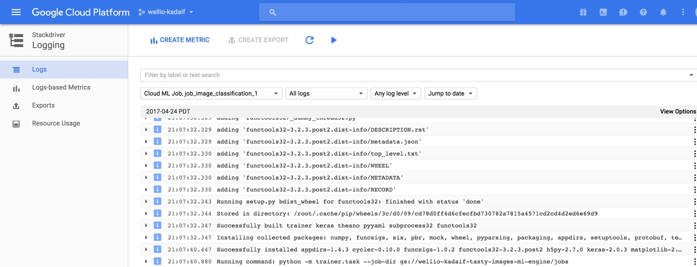

# Instructions on submitting a job using ml-engine.

## 1 - `trainer` folder.

It needs to contain a `.yaml` file where we specify the GPUs to use. Note that as of the time of this writting, they are only available in region `us-east1`.

Besides the `.yaml` file, the `task.py` is the script where our model is described, dataset is loaded from a bucket, and it will be trained and evaluated.

## 2 - `setup.py` file.

Note that the file `setup.py` is one level up the `trainer folder`, and its relevance its due to the fact that we specify the packages required t run the `task.py` script:

```
REQUIRED_PACKAGES = [
  'tensorflow==1.0.1',
  'keras==2.0.3',
]
```
The job is submitted using the command line as it follows:

```
gcloud ml-engine jobs submit training $JOB_NAME \
--job-dir $OUTPUT_PATH \
--runtime-version 1.0 \
--module-name trainer.task \
--package-path trainer/ \
--region $REGION \
--config=trainer/config.yaml
-- \
```

`--module-name trainer.task` specifies the script we need to run: it's the `task` file under the `trainer` folder. If we had a different script to run under the `trainer` folder instead of `task,py`, for example `another_script.py`, then we would change that part of the `ml-engine` job as:

`--module-name trainer.another_script`

Note that in our case, we will specify:

`OUTPUT_PATH = gs://wellio-kadaif-tasty-images-project-pre-processed-images/ml-engine`

(the folder `ml-engine` needs to already exist in the bucket `gs://wellio-kadaif-tasty-images-project-pre-processed-images`)

`JOB_NAME` needs to be unique each time run this job, so it needs to be changed on the command line before submitting it.

`JOB_NAME = job_image_classification_1`

`REGION = us-east1` since GPUs only run on that region.

Effectively, here is what submit in the command line:

```
gcloud ml-engine jobs submit training 'job_image_classification_1' \
--job-dir 'gs://wellio-kadaif-tasty-images-project-pre-processed-images/ml-engine' \
--runtime-version 1.0 \
--module-name trainer.task \
--package-path trainer/ \
--region 'us-east1' \
--config=trainer/config.yaml
```

The job can be monitored using Google Cloud ML Engine GUI:


