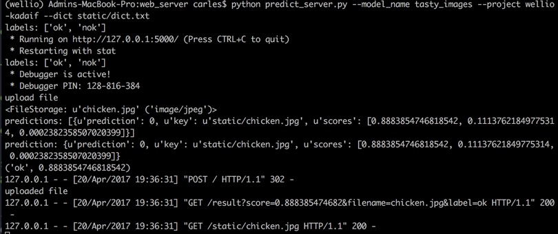

# Classifying images using *transfer learning*.

  - [Setup in Google Storage](#set-up-in-google-storage).
  - [Execution of the script](#execution-of-the-script).
    - [1. Image preprocessing details](##1-image-preprocessing-details).
    - [2. Training and monitoring the model](#2-training-and-monitoring-the-model).
    - [3. Saving and versioning the model](#3-saving-and-versioning-the-model).
    - [4. Making predictions](#4-making-predictions).
    - [5. Using Tensorboard](#5-using-tensorboard).
    - [6. Using Flask to make predictions](#6-using-flask-to-make-predictions).
    - [Appendix: Extending the project to multi-class images](#appendix-extending-the-project-to-multi-class-images).

Using [Google Vision API](https://cloud.google.com/vision/) is a good resource to identify labels, or categories, for a given image. The problem can arise when we need to further classify your own images, in more specialized categories that the Google Vision API hasn't been trained on.

This project shows how an existing neural network can be used to accomplish the above task using *transfer learning* which bootstraps an existing model to reduce the effort needed to learn something new.

The 'Inception v3' architecture model trained to classify images against 1,000 different 'ImageNet' categories, and using its penultimate "bottleneck" layer, is used to train train a new top layer that can recognize other classes of images, like "tasty" or "not-tasty" in this project.

The new top layer does not need to be very complex, and that we typically don't need much data or much
training of this new model, to get good results for our new image classifications.


Besides transfer learning, we show how to use other aspects of TensorFlow and Cloud ML. It shows how to use
[Cloud Dataflow](https://cloud.google.com/dataflow/) ([Apache Beam](https://beam.apache.org/))
to do image preprocessing -- the Beam pipeline uses Inception v3 to generate the inputs to the new 'top layer' that we will train and will use the preprocessing results (TFRecords) to be consumed during training.

This project also includes a tiny "prediction web server" using Flask that uses **Cloud ML API for prediction** once the trained model is serving.

To run the process end to end, we need to run this shell script on the command line: `./tasty_images.sh`

As a **reminder**, we need to first create an anaconda environment with python 2.7.

Then, after creating the environment, we need to setup Google Cloud Platform SDK:

Install Google Cloud Platform SDK https://cloud.google.com/sdk/downloads and follow the instructions for `interactive installer`.

We will also need to install Tensorflow.

Below, all steps executed in the script are described step by step.

## Set up in Google Storage.

The images we downloaded need to be stored in a bucket:

For this project, the bucket is `gs://wellio-kadaif-tasty-images-project-images`


**All required files to pre-process images can be found on the `input_files` folder.**

We need to create a `.csv` file with the path to each image (`all_images_path.csv`), as well as the it's corresponding label. Here is how the file looks like:


From the previous `.csv` file we create a training and validation `.csv` files, using a 90/10 percent split and randomly assigning images to each set (training/validation).

The files are called respectively `train_images_path_set.csv`and `eval_images_path_set.csv`.

Finally, we create a `dict.txt` file, which is a dictionary of the labels we require in our project:


Finally, we load `train_images_path_set.csv`, `eval_images_path_set.csv` and `dict.txt` to the same bucket:


## Execution of the script.

Ensure that the script permissions are the correct ones to be executed. If an error is thrown, then have them changed by issuing  `chmod 755 tasty_images.sh`.

We need to set up some default values in the above script:


The script sends to the screen the `GCS_PATH` for convenience, and we should make note of it as will need it to reference it when launching `tensorboard`.

Note that since hardcode `VERSION_NAME`, if the script is run again to train a new model, it needs to be changed or it will throw an error.

Before start running the script, we need to `source activate MY_ENVIRONMENT` first. In this project `MY_ENVIRONMENT` is `wellio`.

As mentioned at the beginning, we execute `./tasty_images.sh` at the command line.


Note that we specified `--num-workers` to be `100` to get more nodes to process the job. If not specified, it's defaulted to 10 workers.

As soon as the script starts to run, it will start by pre-processing of the images specified on the evaluation `.csv` set of images using Google Dataflow.


Dataflow can be monitored here <https://console.cloud.google.com/dataflow?project=wellio-kadaif>

and by clicking on the highlighted square, we can see the details of the job:


As soon as the evaluation set pre-processing is completed, a new dataflow job starts for the training set.


Once pre-processing is completed, we will have two completed jobs.


## 1. Image preprocessing details.

Preprocessing means that we extract an image features from the "bottleneck" layer which is the penultimate layer of the Inception network. This is achieved by loading the saved Inception model and its variable values into TensorFlow, and run each image through that model, which has been open-sourced by Google.

Each image is processed to produce its feature representation (an *embedding*) which is a k-dimensional vector of floats (in our case, 2,048 dimensions). The preprocessing includes converting the image format, resizing images, and running the converted image through a pre-trained model to get the embeddings.

The reason this approach is so effective for bootstrapping new image classification is that these 'bottleneck'
embeddings contain a lot of high-level feature information useful to InceptionV3 for its own image classification.

Once the pre-processing has been completed, the embeddings can be found in the bucket (which is under `GCS_PATH/preproc`):


## 2. Training and monitoring the model.

Once pre-processing has been completed, the script will continue to run, this time to train the model.


Note that in the folder `trainer`, `task.py` will create the model, and that the `config.yaml` file contains the details of the GPUs to use (only available in Google Cloud `east` region as of the time of this writing).

The `.yaml` file has a link to all possible machines available to run this part of the script.

The neural network will comprise a single fully- connected layer with *RELU* activations and with one output for each label in the dictionary (`dict.txt`) to replace the original output layer.

The final output is computed using the [softmax](https://en.wikipedia.org/wiki/Softmax_function) function. In the
training stages, we use [dropout](https://en.wikipedia.org/wiki/Dropout_(neural_networks)) to randomly ignore a subset of input weights to prevent over-fitting to the training dataset.

The script will output a summary and a model checkpoint information under `$GCS_PATH/training`.

The job can be monitored by looking at the logs here: <https://console.cloud.google.com/mlengine/jobs?project=wellio-kadaif>


We also can monitor the accuracy of the training and evaluation sets:


Once the model has been trained, it will be saved in the next step of the script.

## 3. Saving and versioning the model.

This step of the script will save the model created previously:


Once completed, the script will create a version of it, indicating where it's deployed (`$GCS_PATH/training/model`):


Next, the created version is set as the default one:


The model can be found here: <https://console.cloud.google.com/mlengine/models?project=wellio-kadaif>


To see all models on the cloud, we run on the command line:

`gcloud ml-engine models list`

which outputs:

`NAME          DEFAULT_VERSION_NAME
tasty_images  v1`

## 4. Making predictions.

In this final step, we create a prediction locally, not in the cloud.

We download an image from a bucket, which will be saved in the directory of this project.


Since the image is passed via JSON, we have to encode the JPEG string first:


`python -c 'import base64, sys, json; img = base64.b64encode(open(sys.argv[1], "rb").read()); print json.dumps({"key":"0", "image_bytes": {"b64": img}})' donald_trump.jpg &> request.json`

Then, we make the prediction for the above image (already encoded before):

`gcloud ml-engine predict --model tasty_images --json-instances request.json`


and the predictions:

`KEY  PREDICTION  SCORES
0    0           [0.8072742819786072, 0.19167515635490417, 0.0010505595710128546]`

`KEY` means the order of the item (the image encoded) in the `request.json` object, which is `0` in this case, as we passed only 1 image. The `PREDICTION` index (`0` in this case) corresponds to the label at that index in the `dict.txt` (in this case, corresponds to `ok`), and the score for each index is listed under `SCORES`. (The last element in the scores list is used for any example images that did not have an associated label).

In this example, index `0` is the `ok` label, and index `1` is `nok`. Therefore, the prediction above indicates that Donald Trump image is `ok`, with score `0.8072742819786072`.

If we want to predict multiple images from the command line, we would issue:

`python images_to_json.py -o request.json <image1> <image2> ...`, which also results in a `request.json` object. Then, we will run again `gcloud ml-engine predict --model tasty_images --json-instances request.json` to view the predictions for all encoded images.

In our case, since we have a `prediction_images` folder, for example:

`python images_to_json.py -o request.json prediction_images/knife.jpg prediction_images/puppy2.jpg prediction_images/hedgehog.jpg`

## 5. Using Tensorboard.

From the command line, we will run:

`tensorboard --logdir=GCS_PATH/training`

which translates to:

`tensorboard --logdir=gs://wellio-kadaif-tasty-images-project-images/carles/tasty_images_carles_20170419_184854/training`

and then visualize it in `http://localhost:6006/`

## 6. Using Flask to make predictions.

Run the server from the same virtual environment we have been using and make sure we have all of the web server requirements installed in that environment:

```shell
pip install -r requirements.txt
```

Then, to start the web server, from the command line, go (`cd`) to the folder `web_server`, and run:

`python predict_server.py --model_name tasty_images --project wellio-kadaif --dict static/dict.txt`

The arguments are:

`--model_name`: we pass the model name created before.
`--project`: the project name given by Google when creating the project in Google Cloud.
`--dict`: a text file where the labels are stored (same as `dict.txt` we used to preprocess images before).

`(dsci6007) Admins-MacBook-Pro:web_server carles$ python predict_server.py --model_name tasty_images --project`

 `wellio-kadaif --dict static/dict.txt`

`labels: ['ok', 'nok']`

 `* Running on http://127.0.0.1:5000/ (Press CTRL+C to quit)`

 `* Restarting with stat`

`labels: ['ok', 'nok']`

 `* Debugger is active!`

 `* Debugger pin code: 279-854-597`

`upload file`

`127.0.0.1 - - [20/Apr/2017 09:42:27] "GET / HTTP/1.1" 200 -`

`upload file`

`<FileStorage: u'00001.jpg' ('image/jpeg')>`

`predictions: [{u'prediction': 0, u'key': u'static/00001.jpg', u'scores': [0.9745843410491943, 0.025380853563547134,` `3.4803269954863936e-05]}]`

The prediction above indicates that the image `00001.jpg` belong to the class with label index `0`, which is `tasty`, and the score is `0.9745843410491943` (since the index of the label is `0`, we get the score with index `0`).




## Appendix: Extending the project to multi-class images.

The source information for the 'hugs/no-hugs' images is here: gs://oscon-tf-workshop-materials/transfer_learning/hugs_photos_sources.csv.
